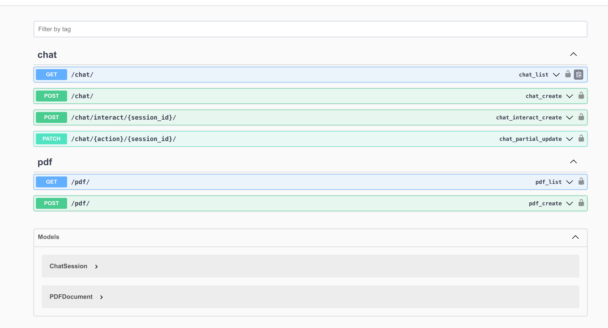

# chatbot
Chatbot with Llama 3.1 and Ollama Framework and DRF
## Setup

1. Clone the repository:
    ```sh
    git clone https://github.com/TRextabat/chatbot.git
    cd chatbot
    ```

## Installing Dependencies

Make sure you have Docker and Docker Compose installed on your machine.

you should setup [Nvidia Containers Toolkit for using GPU](https://docs.nvidia.com/datacenter/cloud-native/container-toolkit/latest/install-guide.html#installation).

## Example .env File

Create a `.env` file in the root of your project with the following content:

    export DEBUG=1
    export SECRET_KEY=your-secret-key
    export DJANGO_ALLOWED_HOSTS=localhost 127.0.0.1 [::1]
    export SQL_ENGINE=django.db.backends.postgresql
    export POSTGRES_USER=postgres
    export POSTGRES_PASSWORD=chat123
    export POSTGRES_HOST=postgres
    export POSTGRES_PORT=5432
    export MAX_FILE_UPLOAD_SIZE=20971520 # 20MB
    export LLAMA_MODEL=llama-3.1-7b
    export LLAMA_URL=http://llama:11434


### Using Docker Compose

1. Build and start the Docker containers:
    ```sh
    docker-compose up --build -d
    ```

2. Apply database migrations:
    ```sh
    docker-compose exec api python manage.py migrate
    ```

3. Create a superuser:
    ```sh
    docker-compose exec api python manage.py createsuperuser
    ```

4. The application will be available at `http://localhost:8000`.


### Data Modles

- **ChatSession**: Represents a chat session with metadata and associated PDF documents.
- **ChatMassage**: Represents individual messages within a chat session.
- **PDFDocument**: Represents uploaded PDF documents with parsed text content.
### Services
- **LlamaService**: Handles the initialization, indexing, and querying of documents using the Llama-index library and the Llama model.

### How It Works

1. **Upload PDF Documents**: User can upload pdf to coudl use it in any session they want in a chat session or multipel chatsessions.
2. **Start a Chat Session**: Users can start a new chat session by using multiple PDFs and providing metadata such as a session name. The PDF documents woudl be parsed, and their text content is indexed for efficient retrieval.
3. **Interact with the Chatbot**: Users can send messages to the chatbot, which processes the messages using the Llama model and responds with relevant information extracted from the indexed documents.
4. **Activate/Deactivate Sessions**: Chat sessions can be activated or deactivated, allowing for multiple active sessions at a time.


## Using the Chatbot
 1. you could see swagger documentation at `http://localhost:8000/swagger/`

 

 ## Note
check ports 8000 and 11434 and 5432 are free. before ruuning the project. for unix systems:

    
    sudo lsof -i :port_number

when you will create your first chat session it will take a little bit long because the app would make modles in backend  
    
    
